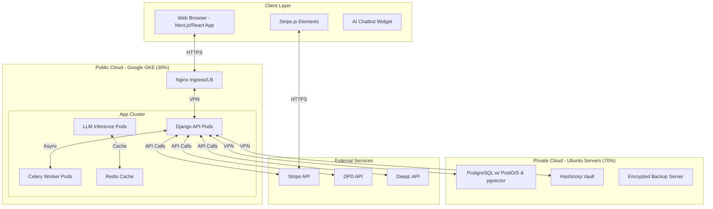

---

### **Optimized & Actionable Project Prompt: "Journey of Life" (JOL)**

**To:** Development Team, Project Managers, Stakeholders
**From:** Lead Architect
**Subject:** Technical Blueprint & Development Mandate for JOL MVP
**Goal:** Create a detailed, implementable plan for a secure, compliant, and scalable MVP.

---

### **1. Project Vision & Business Objective**

**Project Name:** Journey of Life (JOL)
**Vision:** To become the trusted, AI-powered pan-European marketplace that dignifies the end-of-life industry by seamlessly connecting communities of faith, professionals, and individuals.
**Mission (MVP):** Launch a minimally viable, fully functional marketplace in the Baltic states (Estonia, Latvia, Lithuania) for physical goods across three core categories: Church Equipment, Funeral Home Supplies, and Cemetery Maintenance products. The platform must demonstrably handle multilingual content, secure transactions, and GDPR compliance as a foundation for EU-wide scaling.

**Target Users:**
*   **B2B:** Churches (~400k EU-wide), Funeral Homes (~150k EU-wide), Cemetery Services (~120k EU-wide).
*   **B2C:** Small artisans, individual sellers, religious communities.

**Monetization:**
*   **Listing Fee:** Freemium model. First 10 listings per user per month are free. Each subsequent listing costs **€1**.
*   **Transaction Fee:** **1%** commission on all successful sales (min. **€1**), processed securely through the platform.

---

### **2. Core Technical Requirements & Stack Selection**

*   **Backend Framework:** **Django (Python)** with Django REST Framework for a headless, API-first architecture.
*   **Database:** **PostgreSQL** with **PostGIS** (for location-based features) and **pgvector** (for AI-powered semantic search embeddings).
*   **Frontend:** **Next.js** / **React** for a dynamic, intuitive, and SEO-friendly user interface. Design must be accessible, simple, and respectful of the sensitive nature of the industry.
*   **Multilingualism (i18n):** Native Django i18n for static content. **User-Generated Content (UGC)** translation via API integration (e.g., DeepL API for quality) or a self-hosted **Llama 3** model for cost-control. Support for **30 languages** (27 EU + Ukrainian, Russian, Arabic). RTL (Right-to-Left) support for Arabic is mandatory.
*   **AI Feature Priority (MVP):**
    1.  **Multilingual AI Chatbot:** Context-aware customer support, trained on platform rules and FAQs. Primary trust-building tool.
    2.  **Semantic Search:** Natural language product discovery using vector embeddings.
    3.  **Real-time UGC Translation:** On-demand translation of listings and messages.
*   **Infrastructure & DevOps:**
    *   **Strategy:** Hybrid Cloud for cost optimization and control.
    *   **Public Cloud (30% - Scalable Compute):** **Google GKE** (Kubernetes) for orchestrating stateless services: Django API, Celery workers, LLM inference, Redis cache.
    *   **Private Cloud (70% - Secure Data):** Our own **Ubuntu LTS** servers for stateful, critical services: PostgreSQL primary database, Hashicorp Vault (secrets management), encrypted backup servers (BorgBackup).
    *   **Networking:** Secure VPN tunnel (WireGuard) between GKE and private servers. **No public ingress to database servers.**
    *   **Web Server / LB:** Nginx as ingress controller on GKE.
*   **Payments & Compliance:**
    *   **Gateway:** Integrate **Stripe.** Mandatory for its built-in PCI-DSS compliance, SEPA Instant payments, and automated **VAT MOSS** handling for all 27 EU countries. We will **never** handle raw card data.
    *   **Model:** Implement Stripe's Marketplace platform for secure escrow-style payments and automated splits.
*   **Logistics (MVP):** Integrate **DPD API** for shipping cost calculation, label generation, and tracking webhooks.

---

### **3. Paranoid Compliance & Security Mandate (Non-Negotiable)**

*   **GDPR:** Data Protection by Design and by Default.
    *   Appoint a **Data Protection Officer (DPO)** immediately.
    *   PII encryption at rest in PostgreSQL (`pgcrypto`).
    *   Automated workflows for user data erasure requests.
    *   Clear lawful basis for all data processing activities.
*   **Architecture Security:**
    *   TLS 1.3 everywhere.
    *   All secrets in Vault, never in code or config files.
    *   Immutable, encrypted backups.

---

### **4. Deliverables & Success Metrics**

1.  **A Detailed System Architecture Diagram** (C4 Model Level 1-3).
2.  **A Phased MVP Development Roadmap** with bi-weekly sprint goals.
3.  **A Complete ERD (Entity-Relationship Diagram)** for the PostgreSQL schema.
4.  **A GDPR Compliance Checklist & Implementation Plan.**
5.  **A Total Cost of Ownership (TCO) projection** for the hybrid infrastructure.

**Success Metrics for MVP Launch:**
*   User registration and listing creation with < 2% error rate.
*   AI Chatbot resolving > 40% of support queries without human intervention.
*   End-to-end transaction completion (listing to payment to shipping label) under 5 minutes.
*   99.9% platform uptime during Baltic business hours.

***
### **Professionally Structured GitHub README.md**

```markdown
# Journey of Life (JOL)

[](https://opensource.org/licenses/MIT)
[](https://www.python.org/)
[](https://www.djangoproject.com/)
[](https://www.postgresql.org/)
[](https://gdpr-info.eu/)

**The first pan-European, AI-powered B2B/B2C marketplace dedicated to the end-of-life industry.**

JOL connects suppliers of church equipment, funeral services, and cemetery maintenance products with buyers across the European Union, transcending language and cultural barriers with cutting-edge technology, built on a foundation of trust and respect.

> **"A mission-driven platform, built with technical excellence."**

---

## 🌟 Vision

To create a dignified and seamless digital ecosystem for the end-of-life industry, supporting communities of faith, professionals, and individuals during times of need by providing a trusted, transparent, and technologically advanced marketplace.

---

## 🚀 MVP Scope (Phase 1)

Our initial focus is on a secure and compliant launch in the Baltic states, validating our core technology and business model.

*   **Geography:** Estonia, Latvia, Lithuania.
*   **Product Categories:** Physical goods across Church Equipment, Funeral Supplies, and Cemetery Maintenance.
*   **Users:** B2B (Churches, Funeral Homes, Services) & B2C (Artisans, Individuals).
*   **Key Features:**
    *   Multilingual Listings (30 languages, inc. RTL support for Arabic)
    *   AI-Powered Semantic Search & Multilingual Support Chatbot
    *   Secure Escrow Payment Processing with Stripe
    *   Integrated Shipping with DPD
    *   GDPR-Compliant Data Handling by Design

---

## 🛠️ Tech Stack

| Layer | Technology | Rationale |
| :--- | :--- | :--- |
| **Backend** | Django 4.2 (Python), Django REST Framework | Robust, secure, batteries-included framework for rapid development. |
| **Database** | PostgreSQL 15+ with PostGIS & pgvector | Reliability, advanced features for geospatial and AI vector search. |
| **Frontend** | Next.js 13+ (React) | High-performance, SEO-friendly, excellent developer experience. |
| **AI** | Llama 3 (Self-hosted), DeepL API | Cost-effective control over translation and NLP tasks. |
| **Infrastructure**| Hybrid: Google GKE & Private Ubuntu Servers | Optimized for cost, scalability, and security. |
| **Cache** | Redis | High-performance caching for sessions and frequently accessed data. |
| **Payments** | **Stripe** | Full PCI-DSS compliance, VAT MOSS handling, SEPA Instant. |

---

## 🗺️ High-Level Architecture



---

## 🔒 Compliance & Security

We are built on a **Paranoid Compliance** model:
*   **GDPR:** Data encrypted at rest, automated right-to-erasure workflows, DPO appointed.
*   **PCI-DSS:** Zero sensitive payment data handled by our servers. Fully delegated to Stripe.
*   **Infrastructure:** No public ingress to databases. Secure VPN between clouds. Immutable backups.

---

## 💰 Business Model

*   **Listings:** Freemium. First 10 listings per month are free, then **€1** per listing.
*   **Transactions:** **1%** commission on sales (min. **€1**).

---

## 🧩 Getting Involved

We welcome contributions from developers, students, and domain experts who share our vision.

**Prerequisites:**
*   Python 3.11+, Node.js 18+, Docker, PostgreSQL

**Initial Setup:**
```bash
# Clone the repository
git clone https://github.com/your-org/journey-of-life.git
cd journey-of-life

# Setup backend (Django)
cd backend
python -m venv venv
source venv/bin/activate
pip install -r requirements.txt
python manage.py migrate
python manage.py runserver

# Setup frontend (Next.js)
cd frontend
npm install
npm run dev
```
*For detailed development, testing, and deployment guides, please see our [Contributing Documentation](CONTRIBUTING.md).*

---

## 📫 Contact & Links

*   **Documentation:** [Full Technical Docs](docs/) | [API Reference](docs/api.md)
*   **Issue Tracker:** [GitHub Issues](https://github.com/your-org/journey-of-life/issues)
*   **Business Inquiries:** `contact@journey-of-life.eu`

---

## 🙏 Acknowledgments

This project is dedicated to the communities and professionals who serve others with dignity and respect. Built with faith in technology for the journey of life.

**License:** This project is licensed under the MIT License - see the [LICENSE.md](LICENSE.md) file for details.
```
